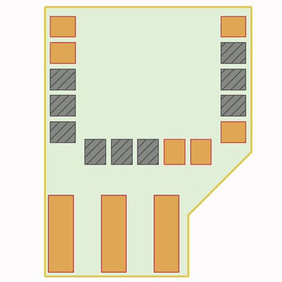
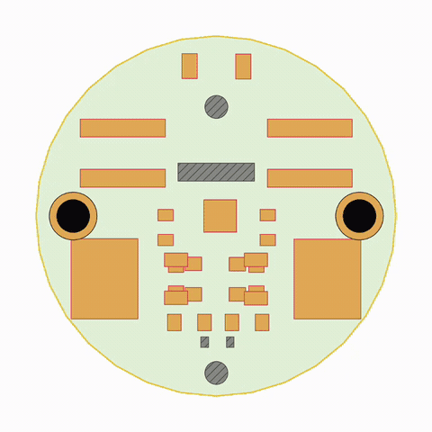

# PCBWorld — a reinforcement-learning environment for PCB routing

| | |
|---|---|
| **Version** | <!--VERSION-->v1.0.0<!--/VERSION--> |
| **KiCad** | 9.0.8 (via the engine submodule) |
| **Python** | 3.12+ |
| **Platform** | Linux x86_64 (primary), macOS |
| **License** | [PCBWorld License 1.0-NC](LICENSE_PCBWorld_1.0-NC.md) (research & education) |

PCBWorld turns KiCad's PNS interactive router into a
[Gymnasium](https://gymnasium.farama.org/) environment: an agent places tracks and
vias on a real board, and every step is scored by the same design-rule checker a
hardware engineer would run — not a grid abstraction.

- **Real EDA physics.** Actions run through KiCad's production push-and-shove
  router; rewards come from its DRC. What routes here routes in KiCad.
- **A complete benchmark.** Synthetic board generators, benchmark task splits, and
  one uniform three-stage evaluation (rollout → post-hoc DRC → aggregate) applied
  identically to every method.
- **Baselines included.** A decoder-only PPO/GRPO transformer trainer, LLM
  tool-calling agents, and classical rule-based routers (FreeRouting, OrthoRoute,
  KRT) — all runnable through the same entrypoints.

The environment exposes 6 routing actions plus an LLM-only `idle`, and hierarchical
JSON-dict observations.

## Demos

An LLM tool-calling agent routing real production boards end to end (time-lapse):

| Case study 1 (`0018_hy_adapter`) | Case study 2 (`0100_smt-zvs-driver`) |
|---|---|
| [](PCBWorld_media/0018_Hardware_Playground_hy_adapter_episode_00_env_00_GPT_success.mp4) | [](PCBWorld_media/0100_smt-zvs-driver_IH10-mc_GPT_success.mp4) |

Click either teaser for the full-length video. All supplementary videos are also
collected in [PCBWorld_media/index.html](PCBWorld_media/index.html).

## Installation

```bash
git clone --recursive https://github.com/LGAI-Research/PCBWorld.git pcbworld && cd pcbworld

# One shot: conda env -> pinned baseline downloads -> engine build -> import smoke
bash tools/setup/setup_all.sh
```

Linux needs no system packages — the conda env ([environment.yml](environment.yml))
ships the complete C++ build toolchain. macOS (Homebrew):
`brew install cmake ninja wxwidgets libgit2 protobuf ngspice libngspice pkgconf nng unixodbc`.

Set `PCBWORLD_ENGINE_HOME` to use an engine checkout somewhere other than `engine/`.

Verify:

```bash
conda activate cadagent
export PYTHONPATH=build_rl/pcbnew/python/rl:.
python -c 'import kicad_rl_router as krl; print("OK")'   # engine smoke test
pytest -q                                                # test suite
```

## Quick start

### 1. Use the environment directly

A standard Gymnasium env over a real `.kicad_pcb` board (run from the
repository root, with the Installation env vars set):

```python
from pcb_world.core.env import PCBWorld

env = PCBWorld(board_path="tests/fixtures/simple_routing_board.kicad_pcb",
               max_steps=200)
obs, info = env.reset(seed=0)
# obs is a JSON dict with six keys: action_history, board_static, closed_nets,
# drc_violations, router_head, routing_geometry.
# actions are dicts {"action_type": <int index>, **params};
# env.action_mask_dict() -> {action_name: bool} for the currently valid actions,
# env.action_masks() the same mask as a positional np.ndarray of 7 bools
# (SB3 MaskablePPO order).

# Route one net: select it, start at one of its pads, auto-finish to the rest.
pad = obs["board_static"]["nets"]["net_1"]["pads"]["pad_0"]
x, y = pad["center"]["xy"]
env.step({"action_type": 0, "net_id": 1})                                  # net_select
env.step({"action_type": 1, "x_mm": x, "y_mm": y, "layer": pad["layer"]})  # start_route
obs, reward, terminated, truncated, info = env.step(
    {"action_type": 5, "routing_mode": 2})                                 # finish (walkaround)
print(reward)  # ~ +2.07 — the routed connection, scored by KiCad's DRC
```

The action set — the seven action names, their index order, and each one's
parameter signature — is defined in one place:
[`pcb_world/core/action_schema.py`](pcb_world/core/action_schema.py)
(`ACTION_REGISTRY`). The full observation/reward specification is in the paper
([PCBWorld.pdf](PCBWorld.pdf)). General entrypoints:
`scripts/train.py` · `scripts/eval.py` · `scripts/profile.py` (all take `--help`).

### 2. Generate synthetic 2-layer boards

```bash
TRAIN_N=200 TEST_N=20 bash tools/datagen/synthetic_generator/generate_2layer_v2.sh
```

(No overrides = the paper-scale 10K train + 1K test set. The generator family in
`tools/datagen/synthetic_generator/` also covers D1 grids and the D2 geometry
variants.)

The default output directories (`var/datasets/synthetic/pcb_dataset_synthetic_2layer_v2*`)
are the generator's own; the training/eval configs read a different layout —
`configs/datasets/d2a.json` looks for `${CADAGENT_DATA_ROOT}/synthetic/synth_2L_v2/{train,val,test}`.
Point the generator straight at that layout with the `*_DIR` overrides:

```bash
export CADAGENT_DATA_ROOT=$PWD/var/datasets
D2A=$CADAGENT_DATA_ROOT/synthetic/synth_2L_v2
TRAIN_N=200 VAL_N=20 TEST_N=20 \
  TRAIN_DIR=$D2A/train VAL_DIR=$D2A/val TEST_DIR=$D2A/test \
  bash tools/datagen/synthetic_generator/generate_2layer_v2.sh
```

Everything downstream (`scripts/train.py`, `eval/pipeline.py`) then resolves the
set through `CADAGENT_DATA_ROOT` — see §5. The generator's final step derives
each board's `.kicad_pro` design rules through the engine, so run it with the
Installation section's `conda activate cadagent` and
`export PYTHONPATH=build_rl/pcbnew/python/rl:.` in effect.

Training (§4) reads a **split file** — which board ids are train/val and which
directory holds them — not a directory. The shipped
[configs/datasets/d2a.json](configs/datasets/d2a.json) lists the 10 000 paper
boards, so a trial set of your own needs its own split file (boards a split lists
but that are absent on disk are warned about and skipped, so the stock `d2a.json`
would train on the handful that overlap):

```bash
python - <<'PY'
import json, pathlib
root = pathlib.Path("var/datasets/synthetic/synth_2L_v2").resolve()
ids = lambda s: sorted(p.stem for p in (root / s).glob("board_*.kicad_pcb"))
json.dump({"easy": {s: ids(s) for s in ("train", "val", "test")},
           "dataset_dirs": {s: str(root / s) for s in ("train", "val", "test")}},
          open("var/datasets/synth_2L_v2_trial.json", "w"))
PY
```

### 3. Get the real boards (D3)

The real-board benchmark derives from the open
[PCBench](https://github.com/PCBench/PCBench) collection (MIT):

```bash
git clone https://github.com/PCBench/PCBench.git
```

Datasets are not bundled with this repo: export `CADAGENT_DATA_ROOT` pointing at
your dataset root (layout: the `sub` paths in
[configs/paths.yaml](configs/paths.yaml)); anything that needs a missing dataset
fails with an error naming the variable. The scripts that turn a PCBench clone
into the D3 benchmark set (DRC repair, guide generation, unrouted variants) ship
with this release — the pipeline and its steps are documented in
[tools/datagen/pcbench_prep/README.md](tools/datagen/pcbench_prep/README.md).

### 4. Train — reproduce the paper's main RL policy (synthetic 2-layer)

```bash
python experiments/train.py table1 --method ppo_per_step --seed 42

# on the trial set from §2 (add --smoke for a one-iteration end-to-end check):
python experiments/train.py table1 --method ppo_per_step --seed 42 \
  --split-json var/datasets/synth_2L_v2_trial.json
```

(`table1` is the recipe's internal name; the resulting policy produces the main
benchmark results — Table 3 in the paper.)

### 5. Evaluate — the uniform 3-stage pipeline

Every routing method (RL transformer · rule-based · LLM agent) is scored by the
same rollout → post-hoc DRC → aggregation pipeline. One invocation runs all
three stages — here with the §4 policy on the §2 test boards — and writes
`per_boards_{ckpts,overall,summary}.csv` into the output cell:

```bash
python -u eval/pipeline.py \
  --ckpt var/outputs/training_logs/table1_synth2l_t3a/ppo_per_step/checkpoints/policy_best.pt \
  --boards-dir var/datasets/synthetic/synth_2L_v2/test \
  --seed 5600 --n-rollouts 5 --n-envs 8 --rollout-mode parallel \
  --output-dir var/results/kdd/d2a/transformer_pcbworld \
  --selection-method posthoc_drc_aware --check-angle 45

python experiments/draw_figure.py --figure all   # paper figures/tables
```

The full reproduction flow — dataset staging, rollout, DRC, aggregation, figure
extraction — is in [docs/QUICKSTART.md](docs/QUICKSTART.md).

Pre-generated datasets are not distributed with the repo. Everything that reads
them resolves paths under a single root: export `CADAGENT_DATA_ROOT` pointing at
your copy, laid out with the `sub` paths listed in
[configs/paths.yaml](configs/paths.yaml) (e.g. `synthetic/synth_2L_v2`,
`pcbench/exacad_sorted`). Anything that needs a dataset without it fails with an
error naming the variable; the corresponding tests skip when it is unset.

## Licensing — two programs, two repositories

**PCBWorld is two separate programs, distributed separately.**

| | Program | Where | License |
|---|---|---|---|
| 1 | **PCBWorld** — the environment, agents, training and evaluation code | this repository | [PCBWorld License 1.0-NC](LICENSE_PCBWorld_1.0-NC.md) |
| 2 | **PCBWorld Engine** — our KiCad modifications, the RL router, the engine server | [LGAI-Research/PCBWorld-Engine](https://github.com/LGAI-Research/PCBWorld-Engine), pinned here as the `engine/` submodule | GPLv3 |

This repository contains no engine or KiCad code — `engine/` is only a submodule
pointer. The environment runs the engine as a child process and talks to it over a
unix socket; they never link into one process, and **no combined artifact (wheel,
image, installer) is built or distributed — do not create one.**
`python tools/check_separation.py` machine-checks all of this (`--runtime` verifies
the process separation via `/proc/<pid>/maps`). Third-party notices for this
repository's Python dependencies: [Notice.md](Notice.md).

> This repository is released under the PCBWorld License 1.0-NC today. We are
> actively considering a move to a permissive license (e.g. BSD-3-Clause) in a
> future release. The engine repository stays GPLv3 either way — it is derived
> from KiCad.

## Architecture

```
Decoder-only PPO / GRPO agent ──────┐   methods/rl_agent/
LLM tool-calling agent ─────────────┤   methods/llm_agent/
                                    ↓   gym.step(action)
PCBWorld ──────────────────────────── pcb_world/core/env.py
                                        6 routing actions (+ idle), JSON observations
    ↓
Engine access layer ────────────────── pcb_world/engine/
                                        KiCadEngine — an RPC client. No engine
                                        library is loaded in this process.
    ↓   unix socket, primitives-only protocol
┌──────────────────────── process boundary ────────────────────────┐
    ↓
Engine server ──────────────────────── engine/engine_server/
                                        the only process that imports the binding
    ↓   kicad_rl_router.RLRouter (pybind11)
RL router (C++) ────────────────────── engine/kicad-patches/rl/
    ↓
KiCad PNS::ROUTER + BOARD ──────────── engine/kicad-python/ (submodule, 9.0.8)
└──────────────────────────────────────────────────────────────────┘
```

## Repository layout

```
pcbworld/
├── pcb_world/         the environment — engine (RPC client) · core (PCBWorld) · diag · vec · rendering · trajectory
├── methods/           routing methods — rl_agent · llm_agent · baselines · _shared
├── eval/              the uniform 3-stage evaluation (rollout -> post-hoc DRC -> aggregate)
├── experiments/       paper reproduction recipes and figure/table extraction
├── scripts/           thin entrypoints — train.py · eval.py · profile.py
├── configs/           path resolver · schema/CLI · drc/masking/reward · dataset splits
├── tools/             manual utilities — setup · datagen · diagnostics · docs
├── tests/             the test suite (pytest, xdist-parallel)
├── docs/              QUICKSTART.md · design/
├── engine/            the GPL engine (submodule — a separate program, GPLv3)
├── external/          RAGEN · verl-agent · OrthoRoute (third-party submodules)
├── var/               generated data (gitignored): results · datasets · checkpoints · crashlogs
└── build_rl/          C++ build output (gitignored)
```

## Notes

- **One live engine per process.** Parallel rollouts use multi-process vector
  environments, one engine each.
- **Routing has long tails.** A single shove can take tens of seconds on a
  congested board; per-action budgets are a caller-side concern.
- If a worker dies on a fatal C++ signal, look under `var/crashlogs/` — the crash
  handler writes the native backtrace and the Python stack there; clean exits
  remove their own logs. One caveat: the test suite crashes workers on purpose
  and normally isolates those artifacts in a throwaway directory, but with
  `KICAD_CRASH_LOG_DIR` exported (e.g. by a sourced `experiments/_lib/env.sh`)
  they land in that directory instead — files left there by a green `pytest`
  run are from those tests and are safe to delete.

## Paper & citation

The benchmark and results are described in [PCBWorld.pdf](PCBWorld.pdf)
([arXiv:2607.05915](https://arxiv.org/abs/2607.05915)), accepted to the KDD 2026
Workshop on Evaluation and Trustworthiness of Agentic AI.

```bibtex
@inproceedings{song2026pcbworld,
  title     = {PCBWorld: A Benchmark Environment for Engine-Grounded
               PCB Design Automation},
  author    = {Song, Hyungseok and Park, Junseok and Choi, Won-Seok and
               Bae, Seohui and Jeong, Han-Seul and Park, Youngjoon and
               Lee, Soonyoung},
  booktitle = {KDD 2026 Workshop on Evaluation and Trustworthiness of
               Agentic AI},
  year      = {2026},
  note      = {arXiv:2607.05915},
}
```

## Project status

This release is ahead of the KDD 2026 submission — faster, with a number of bugs
fixed — and we will keep developing the environment rather than freeze it here.
Feedback, issues and pull requests are welcome.

## Contact

Questions, bug reports and requests to use the benchmark beyond the license terms:
open an issue, or write to hyungseok.song@lgresearch.ai.
